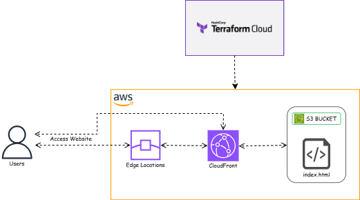

# Brain Puzzle Games: Cost-Optimized Static Web Hosting with AWS S3, CloudFront, and Terraform Cloud

## Overview

**Brain Puzzle Games** is a lightweight static web application comprising a single `index.html` artifact that integrates HTML, CSS, and JavaScript to deliver three interactive client-side games:
- **Sudoku**: A 9x9 grid-based combinatorial logic puzzle with configurable difficulty vectors (Easy, Medium, Hard).
- **Memory Matching**: A 5x9 grid-based cognitive game requiring associative pair matching within a 5-minute temporal constraint.
- **2048**: A numerical sliding tile game necessitating value convergence to achieve a target of 2048, with client-side score persistence.

This repository encapsulates the Infrastructure as Code (IaC) manifests to deploy Brain Puzzle Games on AWS S3 and CloudFront, leveraging **Terraform Cloud** with GitHub VCS integration for automated provisioning. The deployment pipeline provisions a cost-optimized, scalable, and secure static web hosting solution, utilizing S3 for object storage and CloudFront for global content delivery, orchestrated through a declarative IaC framework.

## Architecture Taxonomy

The deployment architecture adheres to a minimalist yet performant paradigm for static web hosting, as depicted in the architecture diagram below:



- **Users** initiate requests to access the application endpoint.
- **AWS CloudFront** operates as the Content Delivery Network (CDN) tier, leveraging its global network of edge locations to cache and deliver content with low-latency access, enforcing HTTPS for transport-layer security.
- **AWS S3 Bucket** serves as the origin storage, hosting the `index.html` file, configured with static website hosting and private access controls.
- **Terraform Cloud** orchestrates the provisioning and lifecycle management of the S3 bucket and CloudFront distribution, integrating with GitHub for VCS-driven automation.

The request flow commences with users accessing the application via CloudFront, which either serves cached content from edge locations or retrieves the `index.html` artifact from the S3 bucket if not cached. Terraform Cloud ensures deterministic, idempotent infrastructure provisioning, optimizing costs through efficient resource utilization.

## Prerequisites

To replicate this deployment, ensure the following prerequisites are met:

- **AWS Account**: An active AWS account with sufficient permissions to provision S3 and CloudFront resources.
- **Terraform Cloud Account**: A Terraform Cloud account with a workspace configured for GitHub VCS integration.
- **GitHub Repository**: Access to this repository ([https://github.com/VedantTK/tf-s3-cloudfront](https://github.com/VedantTK/tf-s3-cloudfront.git)) or a forked copy.
- **AWS Credentials**: AWS Access Key ID and Secret Access Key with permissions to manage S3 and CloudFront resources.
- **Terraform CLI (Optional)**: For local validation, though Terraform Cloud handles remote execution.

## Deployment Steps

### 1. Clone the Repository
Clone this repository to your local environment or fork it to your GitHub account:

```bash
git clone https://github.com/VedantTK/tf-s3-cloudfront.git
cd tf-s3-cloudfront
2. Configure Terraform Cloud Workspace
Sign in to Terraform Cloud and create a new workspace.
Select Version Control Workflow and connect to your GitHub account.
Choose the tf-s3-cloudfront repository and target the main branch.
Configure the workspace to use the Terraform version specified in terraform.tf (e.g., ~> 5.0).
3. Set Up Variables in Terraform Cloud
In the Terraform Cloud workspace, navigate to the Variables tab and define the following:

Terraform Variables:
aws_access_key_id: AWS Access Key ID (mark as sensitive).
aws_secret_access_key: AWS Secret Access Key (mark as sensitive).
Project: BrainPuzzleGames (metadata tagging).
ManagedBy: Terraform (metadata tagging).
Terraform Cloud encrypts sensitive variables, ensuring secure credential management.

4. Trigger a Terraform Cloud Run
Push any changes to the main branch of your GitHub repository to trigger a Terraform Cloud run:
bash
Wrap
Copy
git add .
git commit -m "Initial commit for deployment"
git push origin main
Alternatively, manually queue a plan in Terraform Cloud via the Runs tab.
Terraform Cloud will clone the repository, initialize providers, generate a plan, and apply the configuration to provision the S3 bucket and CloudFront distribution.
5. Access the Deployed Application
Post-deployment, Terraform Cloud outputs the CloudFront distribution endpoint in the Outputs tab (e.g., https://d1234567890abcdef.cloudfront.net). Access this endpoint in your browser to interact with Brain Puzzle Games.

Cost Analysis: A Budget-Conscious Deployment
The cost-optimized nature of this deployment leverages AWS S3 and CloudFront’s pricing models to minimize operational expenditure (OpEx):

S3: ~$0.004/month (10,000 requests, 1 GB data transfer, utilizing S3’s pay-as-you-go pricing).
CloudFront: ~$0.095/month (10,000 requests, 1 GB data transfer, leveraging CloudFront’s edge caching and free tier benefits: 1 TB data transfer out and 10 million GET requests per month for the first 12 months).
Terraform Cloud: Free tier (up to 500 API requests/month, sufficient for this deployment).
Total Operational Cost: ~$0.10/month.
For elevated traffic profiles (e.g., 1 million requests, 10 GB data transfer), costs scale to ~$1.35/month, underscoring the architecture’s economic scalability. CloudFront reduces S3 data egress costs by caching content at edge locations, achieving a cost reduction of approximately 74% compared to direct S3 access (e.g., $4.73/month without CloudFront vs. $1.23/month with CloudFront).

Security Fortifications in the Architecture
Security is a non-negotiable facet of web application deployments, and this architecture incorporates several fortifications to mitigate risks:

Secure Content Delivery with HTTPS: CloudFront enforces HTTPS, ensuring end-to-end transport-layer security for data in transit, protecting against man-in-the-middle (MITM) attacks. The default CloudFront SSL certificate (*.cloudfront.net) eliminates the need for custom certificates, reducing costs while maintaining encryption integrity.
Mitigation Against DDoS Threats: CloudFront integrates AWS Shield Standard at no additional cost, providing robust protection against Distributed Denial of Service (DDoS) attacks. By serving content from edge locations, CloudFront reduces direct exposure of the S3 bucket to the internet, minimizing attack surface.
Granular Access Control: S3 bucket policies restrict access exclusively to CloudFront via OAC, preventing unauthorized public access and ensuring least privilege principles. IAM roles and policies further limit access to authorized entities, enhancing security without additional overhead.
Secure Credential Management: Terraform Cloud’s variable encryption ensures AWS credentials (aws_access_key_id, aws_secret_access_key) are securely stored and injected into runs, mitigating the risk of credential exposure.
These measures collectively fortify the architecture, ensuring robust security while maintaining cost-optimized operations.

Scalability and Performance Optimization
The architecture is inherently designed for scalability and performance:

Horizontal Scalability: CloudFront’s edge locations scale automatically with traffic, ensuring consistent performance as user demand increases, without incurring significant cost overheads due to its pay-as-you-go model.
Performance Optimization: Edge caching reduces latency by serving content from locations geographically proximate to users, minimizing S3 data egress and enhancing user experience.
S3 Scalability: S3’s architecture inherently supports massive scale, handling increased storage and request volumes without performance degradation, further supporting cost efficiency.
These attributes ensure the deployment can accommodate growth in user traffic while maintaining performance and cost efficiency.

Operational Monitoring and Cost Management
To sustain the cost-optimized deployment, I implemented operational monitoring and cost management strategies:

AWS Cost Explorer: Utilized AWS Cost Explorer to monitor expenditure, providing granular insights into S3 and CloudFront costs. This enabled proactive cost management, ensuring alignment with the budget.
CloudWatch Metrics: Leveraged CloudFront CloudWatch metrics to monitor cache hit ratios, request volumes, and data transfer, optimizing caching strategies to further reduce S3 egress costs.
Terraform Cloud Run Insights: Terraform Cloud’s execution telemetry provided visibility into deployment operations, facilitating rapid debugging and optimization of resource provisioning.
These practices ensured ongoing cost efficiency and operational resilience, aligning with the deployment’s cost-optimized ethos.

Operational Challenges and Technical Insights
Several operational challenges provided actionable insights into Terraform Cloud workflows:

VCS Branch Synchronization:
The branch mismatch (master vs. main) precipitated a pipeline failure. The remediation via GitHub UI merge underscored the necessity of preemptive VCS branch alignment with Terraform Cloud’s configuration to ensure pipeline continuity.
Variable Declaration Discrepancies:
Warnings regarding undeclared variables (Project and ManagedBy) arose due to Terraform Cloud’s UI parsing of the tags map as discrete variables. I mitigated this by explicitly declaring them in variables.tf:
text
Wrap
Copy
variable "Project" {
  description = "The project name for resource tagging"
  type        = string
  default     = "BrainPuzzleGames"
}

variable "ManagedBy" {
  description = "The tool managing the resources"
  type        = string
  default     = "Terraform"
}
This highlighted the requirement for explicit variable declarations to align with Terraform Cloud’s variable injection semantics.
CloudFront Propagation Latency:
CloudFront’s distribution provisioning incurred a 5–7 minute latency due to global propagation across 600+ edge locations. Terraform Cloud’s execution telemetry provided observability, ensuring latency transparency without compromising cost efficiency.
Advantages of Terraform Cloud with GitHub VCS Workflow
Terraform Cloud, integrated with GitHub VCS, delivered several operational efficiencies for this cost-optimized deployment:

Automated Lifecycle Management: GitHub VCS integration enabled Terraform Cloud to trigger execution cycles on repository commits, automating the CI/CD pipeline without necessitating supplementary orchestration tools.
Centralized State Persistence: Terraform Cloud managed the state file remotely, mitigating local state management complexities and minimizing state divergence risks at zero incremental cost.
Secure Variable Injection: Sensitive variables (e.g., AWS credentials) were encrypted and dynamically injected, adhering to least privilege access controls without additional security overhead.
Execution Telemetry: Comprehensive run history, logs, and outputs within Terraform Cloud’s UI provided a robust audit trail, enhancing observability and operational debugging.
These capabilities positioned Terraform Cloud as an optimal orchestration platform, ensuring operational efficiency, security, and cost containment.

Conclusion: Cost-Optimized Static Hosting with Terraform Cloud
Deploying Brain Puzzle Games on AWS S3 and CloudFront with Terraform Cloud exemplified the efficacy of IaC and automated workflows in a cost-optimized paradigm. Terraform Cloud’s GitHub VCS integration, remote execution, and secure variable injection streamlined the deployment pipeline, ensuring idempotency and operational efficiency. Key takeaways include:

Preemptive VCS branch synchronization to mitigate pipeline failures.
Explicit variable declarations to harmonize with Terraform Cloud’s injection mechanics.
Utilization of Terraform Cloud’s telemetry for cost-effective deployment observability.
This deployment reinforced Terraform Cloud’s utility for orchestrating infrastructure deployments, particularly for static web applications where cost efficiency, scalability, and security are paramount. Future enhancements under consideration include:

Custom Domain Integration: Integrating Route 53 for custom domain resolution and AWS Certificate Manager (ACM) for SSL/TLS certificates.
Advanced CI/CD Automation: Implementing GitHub Actions for automated deployment triggers on code commits.
Enhanced Security: Adopting IAM roles for Terraform Cloud authentication to bolster security posture.
Operational Monitoring: Leveraging AWS Cost Explorer for ongoing cost monitoring and optimization.
The code for this deployment is available at https://github.com/VedantTK/tf-s3-cloudfront.git for those looking to explore or replicate this architecture. I encourage you to leverage Terraform Cloud with GitHub VCS workflows for your next static web application deployment—it’s a powerful framework for automation, collaboration, and economic scalability.

Thanks for reading! I welcome your feedback, inquiries, or insights on Terraform Cloud deployments in the comments below. Happy deploying! 🚀
